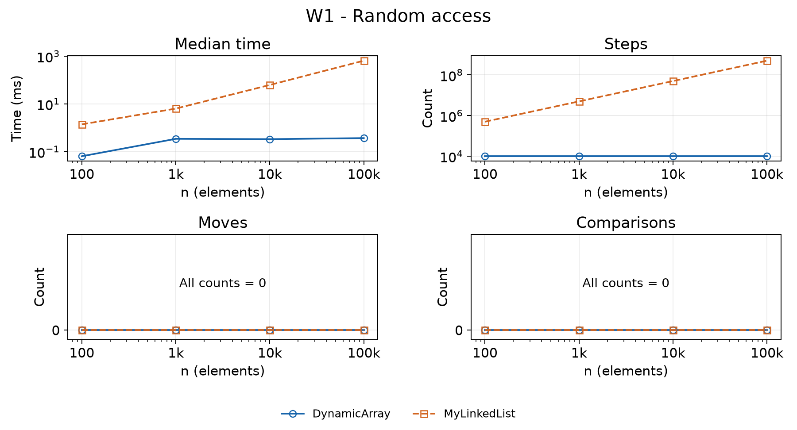
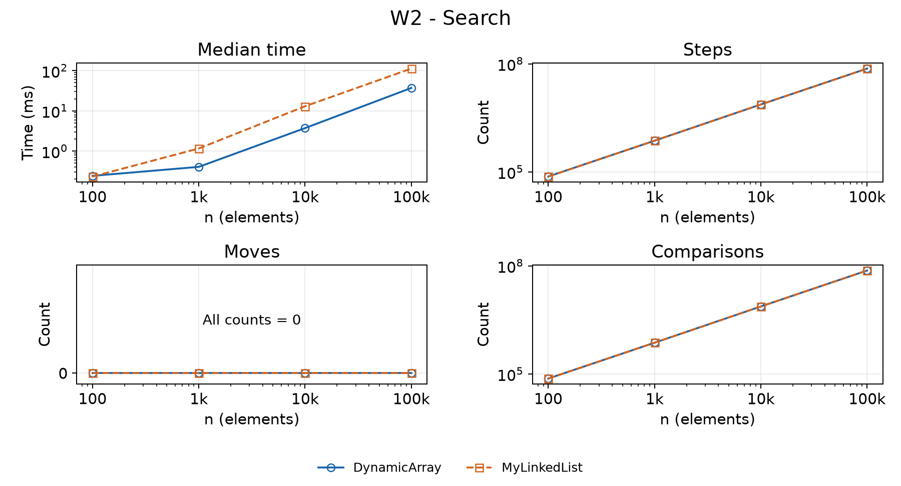
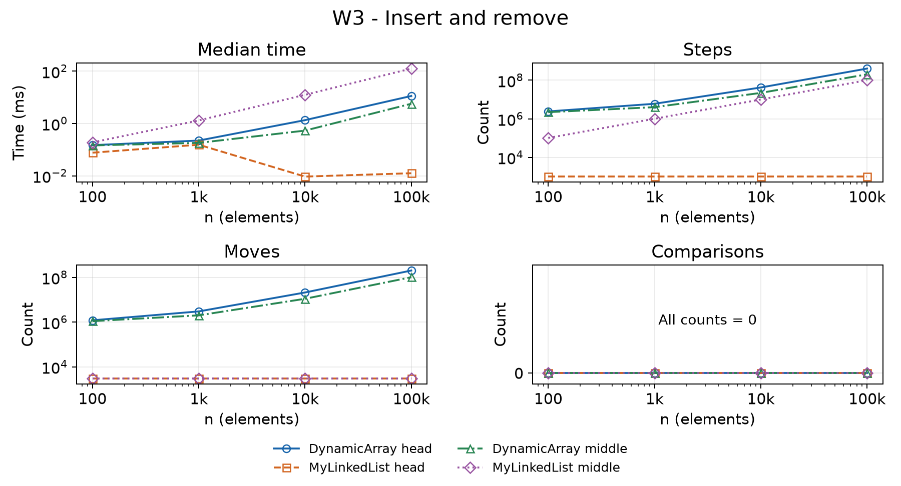
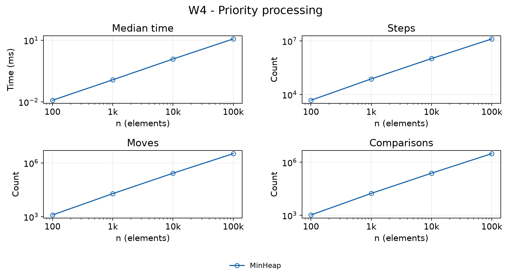
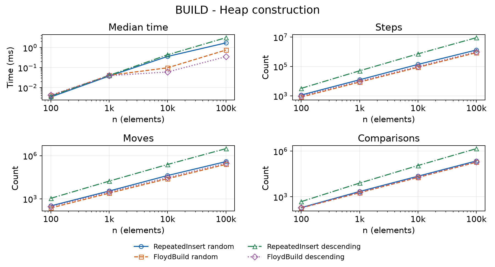
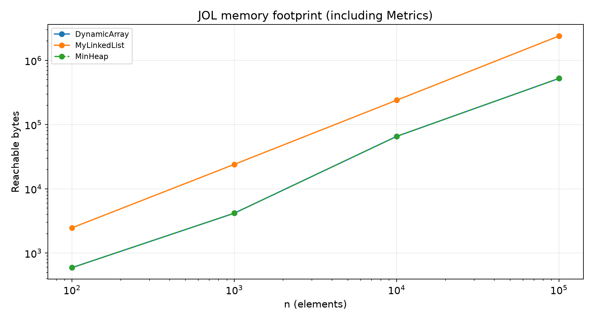

# Assignment 2 - Data Structures

Alua Rakhimzhanova, SE-2509

## Implementation and complexity

DynamicArray and MinHeap store int[] values. MyLinkedList stores primitive int values in singly linked nodes, with head and tail references. DynamicArray and MyLinkedList implement IntList. Production code does not use standard collections.

n is the current size, i is an index, and c is allocated capacity. All table bounds are tight Θ bounds, so each is both O and Ω of the stated expression. Average indexed operations assume a uniform valid index. Average search assumes a uniform first-match position or an absent target.

| Operation | Best | Average | Worst | Extra space |
| --- | --- | --- | --- | --- |
| Array add(x) | Θ(1) | Θ(1) amortized | Θ(n) | Θ(n) on growth |
| Array add(i,x) | Θ(1) | Θ(n) | Θ(n) | Θ(n) on growth |
| Array remove(i) | Θ(1) | Θ(n) | Θ(n) | Θ(1) |
| Array get(i) | Θ(1) | Θ(1) | Θ(1) | Θ(1) |
| Array contains(x) | Θ(1) | Θ(n) | Θ(n) | Θ(1) |
| List add(x) | Θ(1) | Θ(1) | Θ(1) | Θ(1) |
| List add(i,x) | Θ(1) | Θ(n) | Θ(n) | Θ(1) |
| List remove(i) | Θ(1) | Θ(n) | Θ(n) | Θ(1) |
| List get(i) | Θ(1) | Θ(n) | Θ(n) | Θ(1) |
| List contains(x) | Θ(1) | Θ(n) | Θ(n) | Θ(1) |
| Heap insert(x) | Θ(1) | Θ(1) expected amortized* | Θ(n) with growth | Θ(n) on growth |
| Heap peekMin() | Θ(1) | Θ(1) | Θ(1) | Θ(1) |
| Heap extractMin() | Θ(1) | Θ(log n)* | Θ(log n) | Θ(1) |
| Heap buildHeap(input) | Θ(n) | Θ(n) | Θ(n) | Θ(n) new array |
| size(), metrics(), reset() | Θ(1) | Θ(1) | Θ(1) | Θ(1) |

Array insertion shifts n-i values and removal shifts n-i-1. Doubling copies form a geometric sum: 4+8+...+c/2 < c. Thus n appends cost Θ(n) in total. The list needs Θ(i+1) time to reach index i, except append uses tail. Head insertion/removal is Θ(1); tail removal is Θ(n).

*Heap averages assume uniformly random distinct insertion orders. Insertion has expected constant upward travel; growth is amortized. Without growth, its worst case is Θ(log n). Descending input gives Θ(n log n) total repeated-insertion time; random input gives expected Θ(n). Extraction typically follows a root-to-leaf path; equal keys can stop immediately. Average costs require these input assumptions.

Retained storage is Θ(c) for array and heap, and Θ(n) for the list. Arrays do not shrink after removals, so capacity can reflect an earlier larger size. Extra space includes newly allocated storage; without growth, iterative operations use Θ(1) extra space. A diagnostic heap snapshot copies capacity c in Θ(c) time and space and is excluded from measurements.

## Loop invariant proofs

### DynamicArray.contains(value)

**Invariant.** Before iteration i, 0 ≤ i ≤ size and every data[j] with 0 ≤ j < i differs from value. The array and size are unchanged.

**Initialization.** i=0. The checked prefix is empty, so the statement holds.

**Maintenance.** If data[i] equals value, returning true is correct. Otherwise data[i] differs from value. Incrementing i extends the checked prefix by exactly that element and preserves the invariant.

**Termination.** Each unsuccessful iteration increases i. The nonnegative quantity size-i decreases, so the loop ends. At i=size, every stored element differs from value; returning false is correct. An empty array reaches this case immediately.

**Conclusion.** The method returns true exactly when the value exists and never changes the structure.

### DynamicArray.remove(index)

Let A be the array before removal, m its size and k the valid removal index. The saved return value is A[k].

**Invariant.** Before iteration i, k ≤ i ≤ m-1. Positions j<k still contain A[j]. Positions k ≤ j < i contain A[j+1]. Positions i ≤ j < m still contain A[j]. Size remains m.

**Initialization.** i=k. The shifted interval is empty; all positions still match A.

**Maintenance.** data[i]=data[i+1] reads A[i+1] from the unmodified suffix and writes the correct shifted value. Incrementing i extends the shifted interval by one. The prefix and remaining suffix stay unchanged.

**Termination.** m-1-i decreases by one per iteration. At i=m-1, every position from k through m-2 contains A[j+1]. Decreasing size to m-1 excludes the unused last cell. If k=m-1, no shifting is needed.

**Conclusion.** The method returns the removed value, decreases size once and preserves the order of the remaining elements.

### Floyd construction

Leaves are heaps. Processing internal nodes from size/2-1 down to 0 means both child subtrees are heaps before bubbleDown starts. Swapping with the smaller child repairs the current position; only the path below can still need repair. When the root is processed, the whole array is a min-heap. A height-h node costs O(h), with at most n/2^h such nodes. The sum n × Σ(h/2^h) is O(n). Copying n inputs gives Ω(n), hence Θ(n). The input array is copied, not modified or retained.

## Random access and search

Sizes are 100, 1,000, 10,000 and 100,000. Each case uses Random(42), 20 discarded warmups and five measured runs; the median is reported. Inputs, list setup and validation are outside timing. Fresh structures are used each run. Counter totals must agree across all five measured runs.

W1 makes 10,000 random get calls. W2 makes 1,000 searches: 500 values sampled from the data and 500 negative values absent from the nonnegative data. Stored duplicates are allowed.

At n=100,000, W1 takes 0.372 ms for the array and 649.480 ms for the list. The array makes exactly 10,000 cell reads; the list follows 504,930,938 links. W2 takes 37.056 ms and 112.433 ms, with the same 73,682,044 key comparisons. The list's 500 fewer steps arise because a successful match returns before following the next link.

## Boundary updates and priority processing

W3 inserts 1,000 values at a fixed index, then removes 1,000 there. Head uses 0; middle uses the original n/2 even while size changes. W4 times n insertions followed by n extractions. The extracted output is checked for nondecreasing order outside timing.

At n=100,000, head updates take 11.249 ms for the array and 0.013 ms for the list. Middle updates take 5.671 ms and 125.640 ms. The list avoids head shifts but must repeatedly traverse to the middle. W4 takes 11.531 ms with 3,059,125 key comparisons. Repeated extraction makes the full workload Θ(n log n) in the worst case.

Counters are incremented inside operations. Steps count array-cell reads/writes or reads of next links, including null. Moves count existing-element copies/shifts or stored head/tail/next updates; a swap is two moves. Comparisons count keys only. New-value writes are steps, not shifts. Local references, node-value reads, implicit allocation initialization and diagnostics are excluded. Counts describe source-level events, not machine instructions.

## Bonus tasks

BUILD compares construction only; extraction validates after timing. Both methods start empty and include allocation. Floyd also copies its input. The same 20+5 protocol is used for random and descending inputs. At n=100,000, random input takes 1.723 ms with repeated insertion and 0.758 ms with Floyd. Descending input takes 3.139 ms and 0.353 ms; comparisons are 1,468,946 and 199,978. Random insertion is not generally Θ(n log n); descending input demonstrates that worst case.

JOL 0.17 measures each complete reachable object graph, including Metrics and unused capacity. At n=100,000, array and heap each occupy 524,368 bytes; the list occupies 2,400,072 bytes (4.58 times as much). Array and heap curves overlap. Layouts are saved in results/memory_layout.txt.

## Interpretation and verification

### Memory and CPU cache

On this JVM, each node uses 24 bytes: a 12-byte header, a 4-byte int, a 4-byte next reference and 4 bytes of alignment padding. Only 4 of 24 bytes store the value. The list object uses 32 bytes and Metrics uses 40, so its footprint is 24n+72 bytes. The measured object count is n+2.

An int[] has a 16-byte header and 4 bytes per slot. Array and heap objects use 24 bytes each. Including Metrics, their footprint is 4c+80 bytes for the measured capacities. At n=100,000, c=131,072; capacity slack is 31,072 slots or 124,288 bytes. Their object count is three. Measurements use compressed references and 8-byte alignment; byte totals depend on JVM configuration.

Array values occupy adjacent locations. A cache-line fetch can bring several upcoming values into cache, benefiting sequential search and shifting. A list stores separate node objects. Access to the next node depends on loading its pointer first, and nodes are not guaranteed to be adjacent. This pointer chasing limits prefetching and adds memory traffic. Headers, references and alignment increase the working set and allocation pressure.

W2 comparison counts are identical, yet array search is faster at large n, consistent with locality benefits. W1 also has an algorithmic difference: direct indexing versus linear traversal. W3 shows that constant-time head relinking can outweigh array locality, while middle traversal is costly. The heap has compact storage but jumps between tree levels.

The experiment measures time and software counters, not cache misses. It cannot isolate cache effects from JVM compilation, garbage collection, scheduling or counter overhead. Warmups reduce startup effects but do not guarantee stable optimization. Small cases show timing noise; medians and counters should be interpreted together. Nonzero series use logarithmic axes; all-zero counters use linear axes.

### Verification

JUnit 5 compares randomized list operations with ArrayList and heap operations with PriorityQueue. Tests cover empty and single-element structures, duplicates, extreme values, invalid indices, growth, tail repair and reuse after emptying. Heap parent ≤ child is checked after each tested insertion/extraction and build; extraction is also compared with sorting. Build tests cover empty input, null rejection, input independence and a linear comparison bound on descending data. Small examples check exact counter totals.

Three verification passes are recorded in results/verification.txt. The report and six plots use the saved CSV files. Java sources contain no comments. Production code uses no standard collections.

### Environment and reference

Windows 11 Pro; AMD Ryzen 5 5500U; Java HotSpot 25.0.1, 64-bit; JUnit 5.11.4; JOL 0.17. Measured on 4 October 2026. Times are local measurements, not universal speed guarantees.

JOL: https://github.com/openjdk/jol
